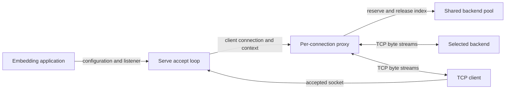
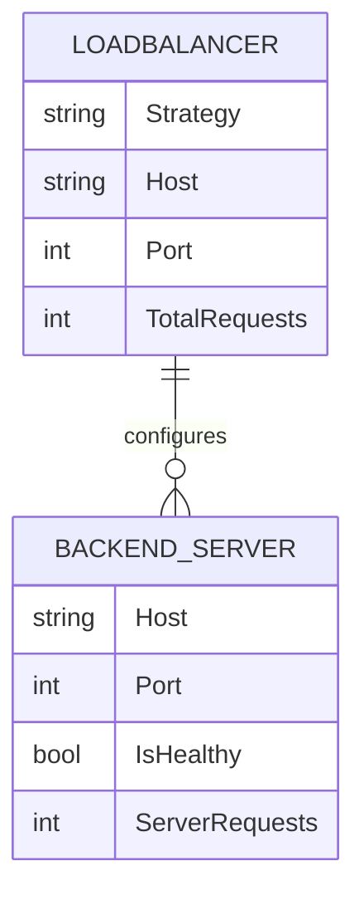
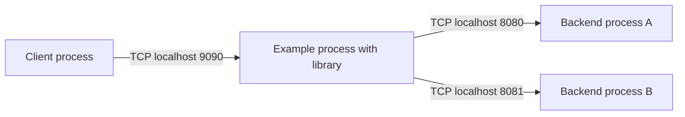

# Architecture

## Overview

The root package is an embeddable TCP proxy; application code owns configuration and supplies a `net.Listener` and `context.Context`. Each accepted connection receives its own proxy goroutine, reserves one eligible backend, and streams through two `io.Copy` calls ([Serve](../../lib.go#L14), [proxy](../../lib.go#L82)). There is no application-protocol parsing in that path.

## Components

| Component | Responsibility | Lives in | Talks to |
| --- | --- | --- | --- |
| Example application | Configures two backends and starts the legacy listener. | [example/](../../example/) · [inventory](03-structure.md#example) | Root library |
| Listener lifecycle | Validates configuration, accepts clients, cancels and waits on exit. | [root package](../../) · [lib.go](../../lib.go#L14) | Caller and per-connection proxies |
| Backend pool and strategy | Holds eligibility, active reservations, and rotation cursor. | [root package](../../) · [types.go](../../types.go#L5), [lib.go](../../lib.go#L54) | Proxies and selection helpers |
| Stream proxy | Dials, copies in both directions, propagates supported half-closes. | [root package](../../) · [lib.go](../../lib.go#L82) | Client and backend sockets |
| Selection helpers | Returns a server value without retaining a reservation. | [root package](../../) · [strategy.go](../../strategy.go#L3) | Shared backend pool |

## Boundaries and contracts

- **Caller to library:** Configure before serving, use one `Serve` per instance, and avoid external access to mutable counters during service ([documented contract](../../README.md#L17)). `Serve` checks for an empty pool, invalid host/port, and unknown nonempty strategy; an empty strategy takes the round-robin selection branch ([validation](../../lib.go#L15), [branch](../../lib.go#L64)).
- **Listener ownership:** After validation, `Serve` closes the listener on return and on cancellation. A cancellation-induced accept failure returns `nil`; another accept error is returned after active proxies are cancelled and joined ([lifecycle](../../lib.go#L26)). Pre-validation errors do not close the listener.
- **Network boundary:** The protocol is opaque TCP bytes. A dial has a three-second timeout; successful streams have no configured idle or duration deadline ([dial](../../lib.go#L96), [copies](../../lib.go#L105)).
- **Eligibility:** `IsHealthy` is a static caller-supplied flag. Dial failure excludes that backend only for the current client and does not update the flag ([filter](../../lib.go#L61), [retry](../../lib.go#L86)).

## Data model

This is an in-memory ownership diagram, not a database schema ([types](../../types.go#L5)).

| Entity | Stored in | Key fields | Defined at |
| --- | --- | --- | --- |
| Loadbalancer | Caller-owned Go value | `Servers`, `Strategy`, mutex, rotation cursor `TotalRequests`; `Host`/`Port` used by legacy wrapper | [types.go:12](../../types.go#L12) |
| BackendServer | Slice element | Address, static eligibility, active reservation count `ServerRequests` | [types.go:5](../../types.go#L5) |
| Per-client retry state | Local map | Attempted backend indices | [lib.go:86](../../lib.go#L86) |

## State and persistence

All service state lives in memory. `reserveWith` increments `ServerRequests` before dialing and advances `TotalRequests` to the next index; `release` decrements when dialing fails or proxying ends ([reservation](../../lib.go#L71), [release](../../lib.go#L77)). Thus reservations include in-progress dials, and `TotalRequests` is not a lifetime request count. There is no persistence or discovery call in the complete [service implementation](../../lib.go); restart reconstructs state from application configuration.

## Deployment

This is the sample topology from [example/example.go](../../example/example.go#L8), not a production deployment prescription. The library can use other addresses supplied by its caller. The tracked repository contains no container manifest or CI/deployment configuration; the complete inventory is in [Structure](03-structure.md).

## Failure and scale

- **Backend dial failure:** Release the reservation and try each remaining eligible server at most once for this connection. If none can be selected, close the client; no protocol-level error is sent ([proxy](../../lib.go#L86)). Sequential attempts can accumulate multiple three-second dial windows.
- **Stream failure:** A copy error closes both connections. Clean EOF half-closes the destination if supported, and the proxy waits for the other direction ([copy handling](../../lib.go#L105)). Copy and dial errors are not surfaced through `Serve`.
- **Shutdown:** Cancellation closes active sockets and waits for handlers; this is bounded by the behavior of the supplied listener/connections, not a configured graceful-drain timer ([Serve](../../lib.go#L27), [socket callbacks](../../lib.go#L84)).
- **Scaling:** Each connected client normally uses two copy goroutines and two sockets, with a single mutex around selection/state. There is no admission limit and no shared state between instances ([accept loop](../../lib.go#L40), [selection](../../lib.go#L55), [copies](../../lib.go#L105)). Least-connections scans the pool; round robin may stop at its first eligible entry.
