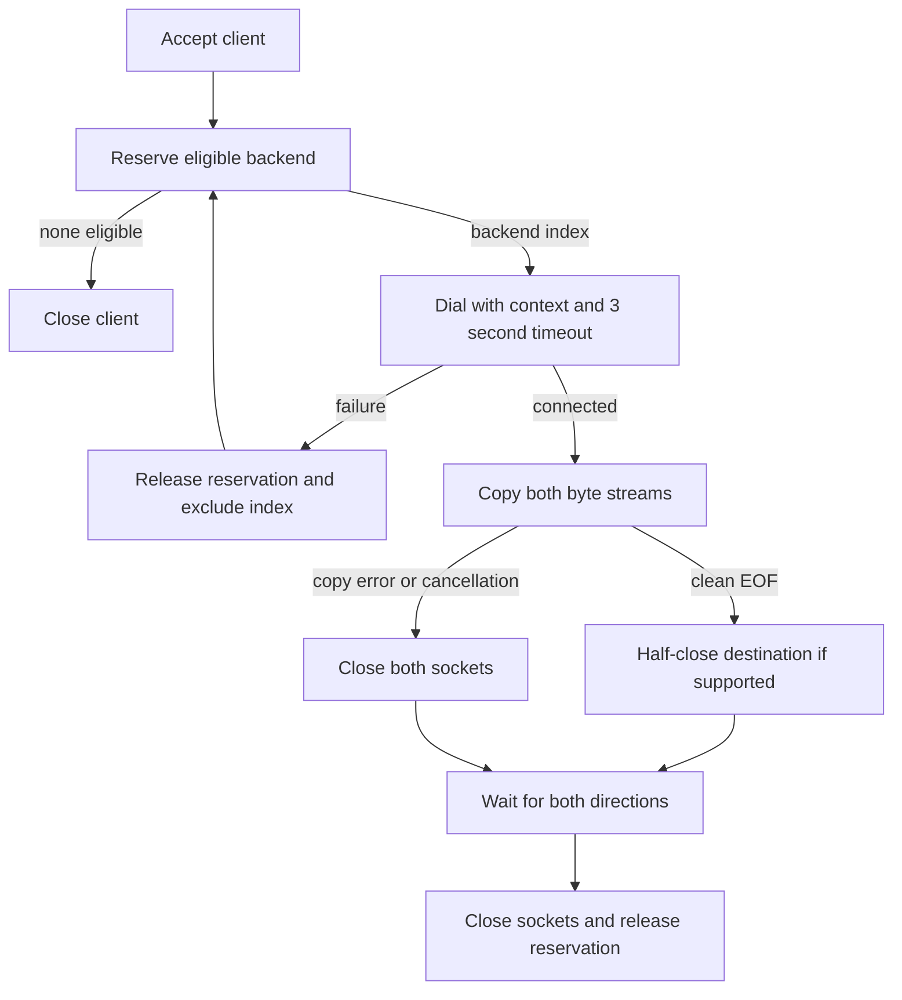
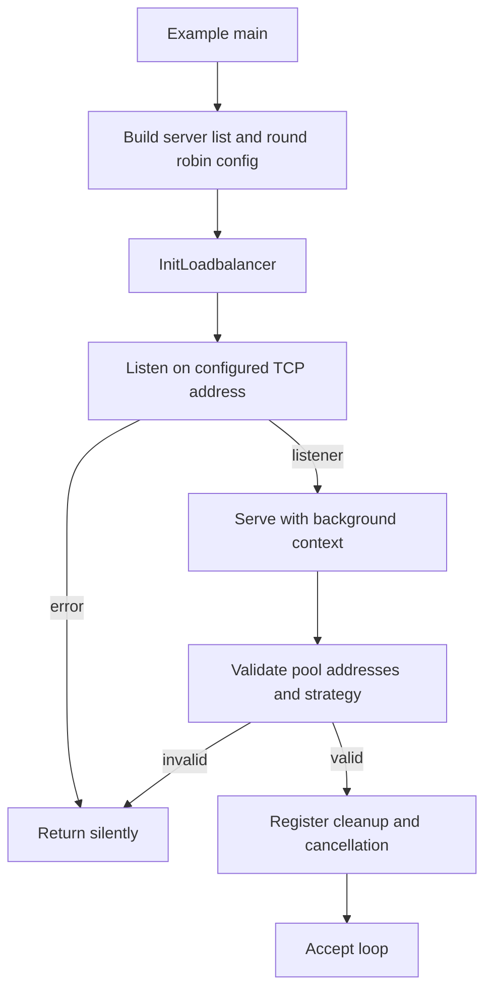
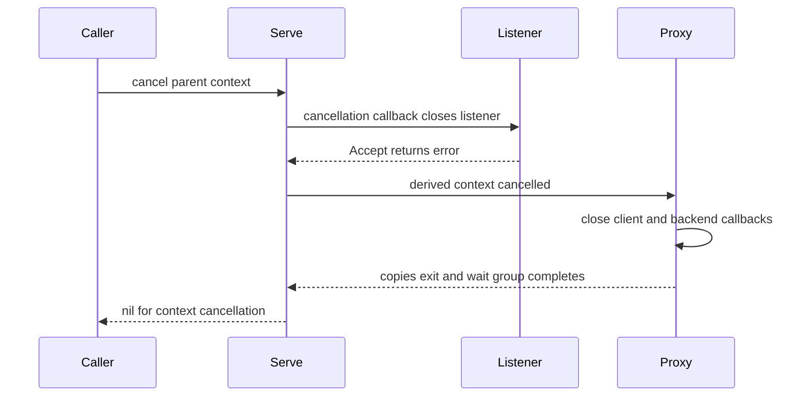
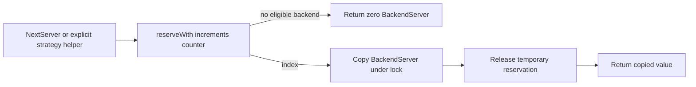
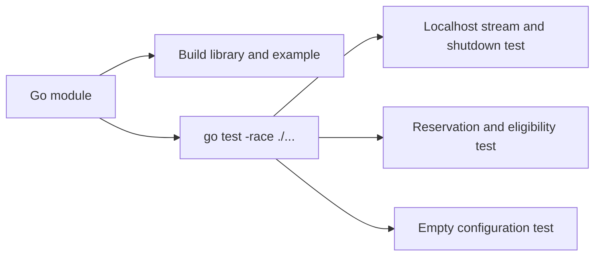

# Flow

## Connection lifecycle

1. **Accept a client.** `Serve` accepts one connection, increments its wait group, and launches `proxy`. [lib.go:33](../../lib.go#L33) · [structure](03-structure.md#root-package)
2. **Arrange cleanup.** The proxy defers client closure and registers a context callback so cancellation interrupts socket I/O. [lib.go:82](../../lib.go#L82) · [structure](03-structure.md#root-package)
3. **Reserve atomically.** Scan from the rotation cursor under the mutex, skip unhealthy/excluded indices, and choose the first eligible server for round robin or the lowest reservation count for least-connections. Ties retain the first entry encountered from that cursor. Increment its count before returning. [lib.go:54](../../lib.go#L54) · [structure](03-structure.md#root-package)
4. **Dial or retry.** Record the selected index in the per-client exclusion map, copy its configuration under lock, then dial using the context and three-second timeout. Failure releases the reservation and repeats selection; no eligible index ends the proxy and closes the client. [lib.go:86](../../lib.go#L86) · [structure](03-structure.md#root-package)
5. **Stream concurrently.** After dialing succeeds, defer backend closure and reservation release. One goroutine copies client to backend while the proxy goroutine copies backend to client. [lib.go:101](../../lib.go#L101) · [structure](03-structure.md#root-package)
6. **Finish both directions.** Clean EOF invokes `CloseWrite` on the destination when that method exists; a copy error closes both sockets. Wait for the outbound copy's completion channel, then run deferred cleanup and complete the wait-group item. There is no retry after stream copying begins. [lib.go:105](../../lib.go#L105), [lib.go:127](../../lib.go#L127), [lib.go:41](../../lib.go#L41) · [structure](03-structure.md#root-package)

## Startup

1. **Construct configuration.** The example supplies two healthy localhost backends, round robin, and frontend port 9090. [example/example.go:7](../../example/example.go#L7) · [structure](03-structure.md#example)
2. **Open the listener.** `InitLoadbalancer` uses the balancer's `Host`/`Port` and invokes `Serve` with a background context, discarding its returned error. Embedders can instead open their own listener and call `Serve` directly. [lib.go:44](../../lib.go#L44) · [structure](03-structure.md#root-package)
3. **Validate before ownership cleanup.** Reject an empty pool, empty host, out-of-range port, or unknown strategy. The error happens before the deferred listener close, so the caller remains responsible for closing a listener on this path. [lib.go:15](../../lib.go#L15) · [structure](03-structure.md#root-package)
4. **Install lifecycle controls.** Register listener cleanup and a parent-context callback; create a derived context used by proxies; defer cancellation and waiting for the proxy wait group. Then enter the accept loop. [lib.go:26](../../lib.go#L26) · [structure](03-structure.md#root-package)

## Cancellation and listener failure

1. **Interrupt acceptance.** Parent cancellation closes the listener via `context.AfterFunc`. An externally closed/broken listener can also cause `Accept` to fail. [lib.go:27](../../lib.go#L27), [lib.go:33](../../lib.go#L33) · [structure](03-structure.md#root-package)
2. **Choose the return value.** Return `nil` if the context is cancelled when the accept error is handled; otherwise preserve the accept error. The deferred function cancels the derived context in either case and waits for every proxy. [lib.go:29](../../lib.go#L29) · [structure](03-structure.md#root-package)
3. **Stop in-flight work.** `DialContext` observes cancellation and active connections are closed by callbacks, allowing the copy paths to finish and release reservations. This actively terminates streams rather than waiting indefinitely for clients to finish normally. [lib.go:84](../../lib.go#L84), [lib.go:96](../../lib.go#L96), [lib.go:103](../../lib.go#L103) · [structure](03-structure.md#root-package)

## Selection helpers

1. **Choose a strategy.** `NextServer` uses the configured strategy; `RoundRobin` and `LeastConn` pass explicit constants to the shared helper. These calls do not invoke `Serve` validation. [strategy.go:4](../../strategy.go#L4), [strategy.go:18](../../strategy.go#L18) · [structure](03-structure.md#root-package)
2. **Return a selection snapshot.** Reserve temporarily, copy the selected server, release it, and return the value. No eligible backend returns the zero value. The shared cursor advances, and the copied count includes the temporary reservation. [strategy.go:7](../../strategy.go#L7), [lib.go:71](../../lib.go#L71) · [structure](03-structure.md#root-package)

## Build and verification

1. **Resolve the module.** Go uses the declared module path and Go 1.23.2 directive; no third-party requirements are present. [go.mod:1](../../go.mod#L1) · [structure](03-structure.md#repository-documents-and-configuration)
2. **Build the entry points.** `go build ./...` checks the root library and example import against the public API. [example/example.go:4](../../example/example.go#L4) · [structure](03-structure.md#example)
3. **Run the behavioral tests.** `TestStreamAndShutdown` sends 140,000 bytes through localhost sockets and checks cancellation completes within three seconds. `TestStrategies` checks least-connections reservations and static eligibility/exclusion. `TestEmptyConfiguration` checks rejection of an empty pool. [lib_test.go:12](../../lib_test.go#L12), [lib_test.go:60](../../lib_test.go#L60), [lib_test.go:76](../../lib_test.go#L76) · [structure](03-structure.md#root-package)

There are no authentication or periodic health-check flows in the [complete runtime implementation](../../lib.go). The [index](README.md#open-questions) records the branches lacking direct tests.
